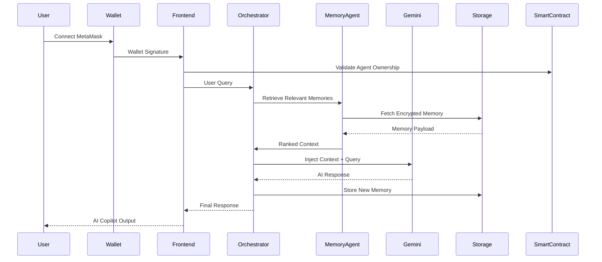
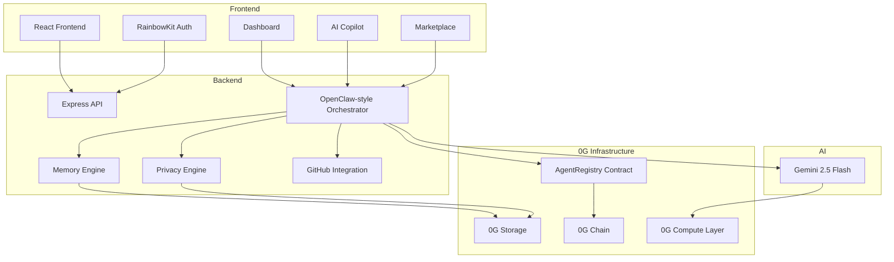

# NeuroVault Enterprise

<p align="center">
  
  
  
  
  
  
</p>

<p align="center">
  <b>Enterprise AI Memory Infrastructure powered by Decentralized Intelligence</b>
</p>

---

## Project Overview

NeuroVault Enterprise is a decentralized enterprise AI memory infrastructure platform that enables AI copilots and autonomous agents to remember, evolve, and securely retrieve long-term organizational intelligence using 0G decentralized infrastructure.

Traditional AI copilots are stateless. They forget previous interactions, cannot retain enterprise knowledge across sessions, and struggle with long-context organizational reasoning.

NeuroVault Enterprise solves this by introducing:

- Persistent decentralized AI memory
- Multi-agent orchestration
- Wallet-based AI ownership
- Long-term enterprise knowledge persistence
- Encrypted memory storage
- AI-native infrastructure powered by 0G

The platform enables organizations to build AI agents that continuously learn from:

- GitHub repositories
- Engineering incidents
- Enterprise documentation
- Operational workflows
- DevOps activities
- Workspace memories

These memories are stored using 0G Storage and retrieved dynamically during AI reasoning workflows.

---

## Key Features

- **Persistent AI Memory** — AES-256-GCM encrypted, stored on 0G Storage
- **Multi-Agent Orchestration** — Memory → DevOps → Billing → Privacy pipeline
- **Agent Identity System** — On-chain registry on 0G Mainnet
- **Enterprise Knowledge Retrieval** — Vector embedding + cosine similarity search
- **GitHub Intelligence Integration** — Live repos, commits, issues, PRs injected into Gemini context
- **Encrypted Memory Storage** — Per-record AES-256-GCM with PII scanning
- **Wallet-based Ownership** — Address = identity, no passwords
- **Real-time AI Copilot** — Gemini 2.5 Flash + orchestrator + live GitHub data
- **Agent Marketplace** — Install agents that create real on-chain identities
- **Privacy-first Architecture** — Privacy agent always runs last; PII redacted before every response

---


# 🏗️ System Architecture

## High-Level Architecture



## Infrastructure Architecture



---

### System Flow


### Layer Breakdown

| Layer | Tech | Purpose |
|-------|------|---------|
| **Frontend** | React 18, Vite 7, RainbowKit, wagmi | Wallet-gated SPA |
| **Backend** | Express 5, TypeScript, Drizzle ORM | API + workspace storage |
| **Orchestration** | OpenClaw-style 4-agent pipeline | Memory → DevOps → Billing → Privacy |
| **AI** | Gemini 2.5 Flash | Reasoning, summarization, context assembly |
| **Storage** | 0G Storage SDK | Encrypted memory persistence |
| **Blockchain** | 0G Mainnet | `AgentRegistry.sol` for agent identity |

---

## 0G Modules Used

### 0G Storage
**Code:** `server/lib/zeroGStorage.ts`

Uploads/retrieves AES-256-GCM encrypted memory objects via `@0glabs/0g-ts-sdk` Indexer. Active when `ZG_PRIVATE_KEY` is set. Defaults to mainnet endpoints (`https://evmrpc.0g.ai`, `https://indexer-storage.0g.ai`). Gracefully degrades to `.0g-fallback-cache/` when key is absent.

**Exports:** `uploadMemory`, `retrieveMemory`, `storageStatus`

### 0G Chain + Smart Contract
**Code:** `contracts/AgentRegistry.sol`, `server/lib/contract.ts`, `scripts/deploy.ts`

`AgentRegistry.sol` stores agent identities on-chain (owner wallet, name, role, memory size). `contract.ts` holds chain config, ABI, and helpers. `deploy.ts` compiles + deploys via `solc` + `ethers`. Each operator deploys their own instance — no hardcoded shared address.

- **Default chain:** 0G Mainnet (Chain ID 16660, RPC `https://evmrpc.0g.ai`, explorer `https://chainscan.0g.ai`)
- **Override:** `ZG_CHAIN=0g-galileo` for testnet

### Agent ID (On-chain Registry)
**Code:** `contracts/AgentRegistry.sol`, `server/lib/contract.ts`, `server/routes.ts`

Every agent gets a UUID. Once deployed, agents register on-chain via `AgentRegistry.createAgent()`. Registry maps agent IDs to owner wallets — queryable on 0G Mainnet explorer.

### 0G Compute Network
**Code:** `server/lib/zeroGCompute.ts`, `server/orchestrator.ts`

`executeInference` abstraction with three modes: `simulated` (default), `0g` (decentralized inference), `openai`. Set `COMPUTE_PROVIDER=0g` to activate. The orchestrator calls this layer for every reasoning step.

### Privacy / TEE
**Code:** `server/lib/encryption.ts`, `server/agents/privacyAgent.ts`, `server/orchestrator.ts`

AES-256-GCM with random 32-byte salt + 12-byte IV per record. PII scanner detects emails, phones, SSNs, credit cards via regex. **Privacy Agent is always injected last** in every orchestrator pipeline — no response leaves without a PII sweep.

---

## How 0G Supports the Product

0G gives NeuroVault:

- **Tamper-resistant memory** — decentralized, no single point of control
- **Long-term persistence** — memory survives session restarts and server resets
- **Verifiable ownership** — wallet-linked agent IDs on-chain, publicly queryable
- **Decentralized intelligence** — infrastructure independent of centralized cloud
- **Scalable enterprise AI** — storage and compute scale independently

---

## OpenClaw-Style Orchestration

```
POST /api/orchestrator/run
       │
       ▼
 ┌────────────────┐
 │ Memory Agent   │ ← retrieves top-K relevant memories
 └────────┬───────┘
          ▼
 ┌────────────────┐
 │ DevOps Agent   │ ← classifies query, recommends actions
 └────────┬───────┘
          ▼
 ┌────────────────┐
 │ Billing Agent  │ ← usage tracking, cost estimation
 └────────┬───────┘
          ▼
 ┌────────────────┐
 │ Privacy Agent  │ ← ALWAYS LAST: PII redaction
 └────────┬───────┘
          ▼
   final response + audit log entry
```

---

## Gemini AI Integration

Gemini 2.5 Flash powers:

- Enterprise reasoning across all agent steps
- Memory summarization and auto-tagging
- Contextual Copilot responses with live GitHub data
- Knowledge extraction from ingested content
- Autonomous agent decision-making in the marketplace

---

## GitHub Intelligence Integration

- Live GitHub repo ingestion via PAT
- Commit analysis injected into every Copilot message
- Issue and PR summarization
- Sync-to-memory: indexes repos as searchable enterprise knowledge
- AI memory auto-created from engineering activity

---

## Smart Contract Details

**Contract Name:** `AgentRegistry.sol`
**0G mainnet contract address:** 0x9D06eaEFfD214C2fb14Fad09cBEd469816F01299
**Deployed on 0G Mainnet:** [View on Explorer](https://chainscan.0g.ai/address/0xb80232b4395e9cb595856f869614d49a58da8b1b)

**Features**

- **Agent Creation** — Mint new on-chain agent IDs with name, role, and memory size
- **Ownership Validation** — `onlyOwnerOf` modifier ensures only wallet owners can modify their agents
- **Metadata Storage** — On-chain storage of agent name, role, memory size, and owner address
- **On-Chain Identity Registry** — Publicly queryable mapping of agent IDs to wallet addresses

**Key Functions**

| Function | Purpose |
|----------|---------|
| `createAgent(name, role, memorySize)` | Mint on-chain agent ID |
| `getAgent(id)` | Fetch owner + metadata |
| `transferOwnership(id, newOwner)` | Verifiable ownership transfer |
| `getAgentsByOwner(wallet)` | List all agents for a wallet |
| `updateMemorySize(id, newSize)` | Owner-only metadata update |
| `totalAgents()` | Global agent count |

**Deployment:** Each operator deploys their own instance via Admin panel or `scripts/deploy.ts`. Address written to `contracts/deployments.json` and loaded at runtime.

| Field | Value |
|-------|-------|
| Chain | 0G Mainnet (Chain ID 16660) |
| Explorer | https://chainscan.0g.ai |
| Deploy Command | `npx tsx scripts/deploy.ts` |

---

## Quick Start

```bash
git clone https://github.com/Prasannaverse13/NeuroVault.git
cd NeuroVault
npm install

# Create .env with GOOGLE_API_KEY and ZG_PRIVATE_KEY
npm run dev    # http://localhost:5000
```

### Deploy Contract to 0G Mainnet

```bash
ZG_PRIVATE_KEY=0x... npx tsx scripts/deploy.ts
```

### Testnet (Galileo)

```bash
ZG_PRIVATE_KEY=0x... ZG_CHAIN=0g-galileo npx tsx scripts/deploy.ts
```

---

## Wallet + Network Setup

### MetaMask: 0G Mainnet

| Field | Value |
|-------|-------|
| Network Name | 0G Mainnet |
| RPC URL | https://evmrpc.0g.ai |
| Chain ID | 16660 |
| Currency Symbol | 0G |
| Explorer | https://chainscan.0g.ai |

RainbowKit auto-prompts network addition on connect. **Testnet faucet:** https://faucet.0g.ai

---

## Testing Guide (For Judges)

1. **Connect wallet** — MetaMask auto-adds 0G Mainnet
2. **Link GitHub** — Integrations page → enter PAT with `repo` scope
3. **Ask Copilot** — Query repos, commits, issues; verify context-aware responses
4. **Sync to memory** — Copilot sidebar → index GitHub data as searchable knowledge
5. **View memories** — Memory page shows encrypted entries
6. **Check Admin** — Contract status, audit log, on-chain agent registry
7. **Verify on explorer** — View deployed `AgentRegistry.sol` at `https://chainscan.0g.ai`

---

## Track Coverage

| Track | Fit |
|-------|-----|
| **T1: Agentic Infrastructure** | OpenClaw orchestrator + memory pipeline + multi-agent routing |
| **T3: Agentic Economy** | Wallet-owned marketplace + on-chain registry + billing agent |
| **T5: Privacy & Sovereign Infra** | AES-256-GCM + privacy agent (always last) + decentralized storage |

---

## Tech Stack

**Frontend:** React 18, Vite 7, RainbowKit, wagmi, TanStack Query, Tailwind  
**Backend:** Express 5, TypeScript, Drizzle ORM, Zod, Winston  
**AI:** Gemini 2.5 Flash, Vector Embeddings, Cosine Similarity  
**Blockchain:** 0G Mainnet, Solidity ^0.8.20, Ethers.js, solc  
**Storage:** 0G Storage SDK, AES-256-GCM, Local Fallback Cache  

---

## License

MIT © 2026 NeuroVault Enterprise
